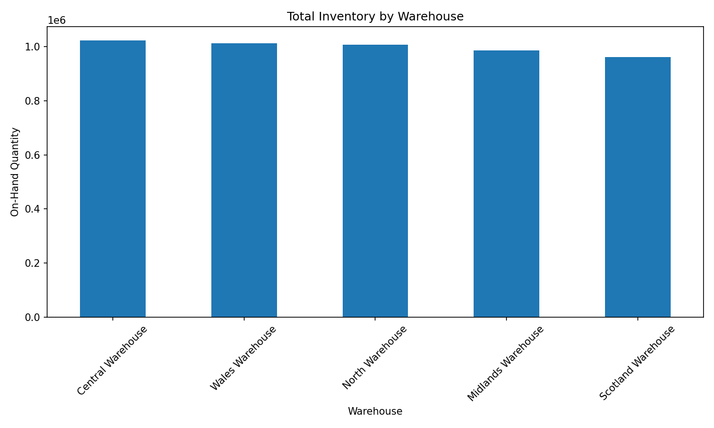
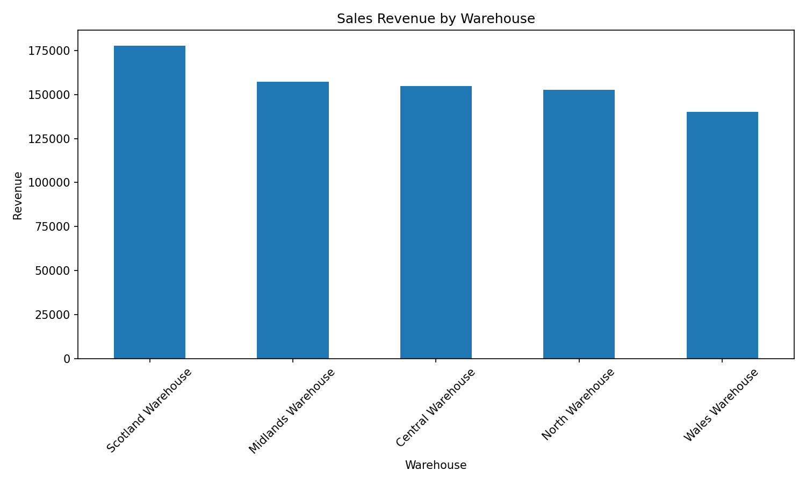
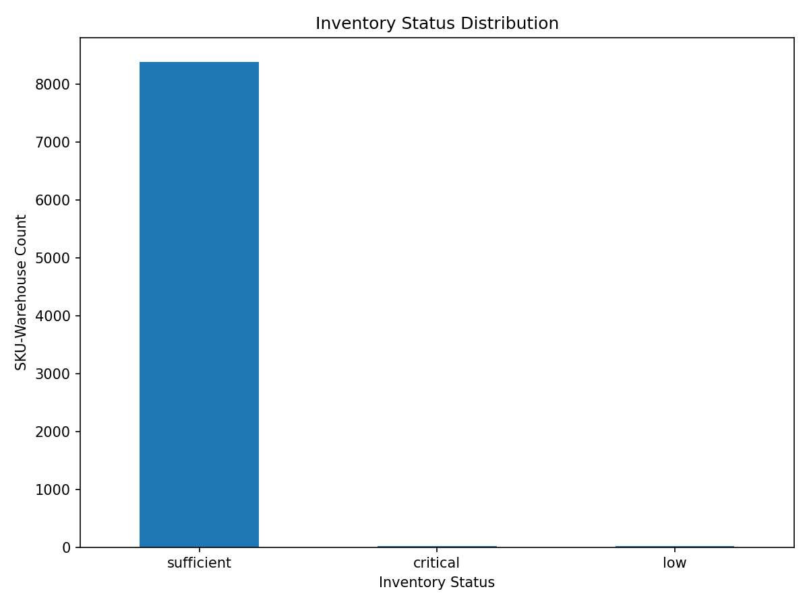

# FMCG Inventory Data Integration Pipeline

A portfolio-oriented Data Engineering project that builds a reproducible ETL pipeline for integrating FMCG sales, orders, inventory, warehouse, and product data.

The project uses Python, Pandas, SQLite, Docker, and data-quality validation to create a business-ready inventory dataset.

---

## 1. Business Problem

FMCG businesses need reliable inventory data across multiple warehouses to understand:

* How much inventory is available?
* Which warehouses hold the most stock?
* Which products have high sales activity?
* Which inventory positions may become critical after pending orders?
* Can sales, orders, inventory, products, and warehouses be analyzed together?

This project builds the data layer required for these questions.

It focuses on **Data Engineering rather than optimization or AI**.

The resulting dataset can serve as a foundation for future inventory allocation or warehouse decision-support systems.

---

## 2. Project Context

The business context is inspired by warehouse inventory allocation problems such as those discussed in the 100RFS challenge.

The original public transaction data does not contain warehouse-level inventory information.

Therefore, this project combines:

1. Public transaction data from the UCI Online Retail II dataset.
2. Simulated warehouse master data.
3. Simulated inventory snapshots.
4. Simulated customer orders.
5. A generated product master.

The simulated datasets are intentionally designed to demonstrate an end-to-end Data Engineering workflow.

---

## 3. Data Sources

### Public Source

The sales transaction foundation comes from the **UCI Online Retail II dataset**.

UCI Machine Learning Repository:

https://archive.ics.uci.edu/

The dataset contains UK online retail transactions covering approximately two years.

The original dataset includes fields such as:

* Invoice
* StockCode
* Description
* Quantity
* InvoiceDate
* Price
* Customer ID
* Country

The original Excel file is kept in:

```text
data/raw/online_retail_II.xlsx
```

The source dataset is not modified.

### Simulated Data

The following datasets are generated by this project:

* `sales.csv`
* `orders.csv`
* `inventory.csv`
* `warehouses.csv`
* `products.csv`

Warehouse assignments, inventory snapshots, orders, and product master records are simulated for the purpose of demonstrating the ETL pipeline.

---

## 4. Architecture

```text
                    UCI Online Retail II
                             |
                             v
                    +------------------+
                    |  Raw Source Data |
                    +------------------+
                             |
                             v
                         EXTRACT
                             |
                             v
                      VALIDATE RAW
                             |
                             v
                        TRANSFORM
                             |
                             v
                        INTEGRATION
                             |
                             v
                  Business-Ready Dataset
                             |
                             v
                       SQLite Load
                             |
                             v
                      QUALITY CHECK
                             |
                             v
                    Business Analysis
```

---

## 5. Project Structure

```text
project-01/
├── data/
│   ├── raw/
│   │   ├── online_retail_II.xlsx
│   │   ├── sales.csv
│   │   ├── orders.csv
│   │   ├── inventory.csv
│   │   ├── warehouses.csv
│   │   └── products.csv
│   │
│   └── processed/
│       ├── sales.csv
│       ├── orders.csv
│       ├── inventory.csv
│       ├── warehouses.csv
│       ├── products.csv
│       ├── integrated_sales.csv
│       ├── integrated_orders.csv
│       ├── inventory_summary.csv
│       └── inventory_business_ready.csv
│
├── database/
│   └── inventory.db
│
├── figures/
│   ├── inventory_by_warehouse.png
│   ├── revenue_by_warehouse.png
│   └── inventory_status.png
│
├── src/
│   ├── data_generation/
│   │   ├── generate_raw_data.py
│   │   ├── create_dirty_data.py
│   │   └── __init__.py
│   ├── __init__.py
│   ├── extract.py
│   ├── validate.py
│   ├── transform.py
│   ├── integrate.py
│   ├── load.py
│   ├── quality_check.py
│   ├── business.py
│   ├── analysis.py
│   └── main.py
│
├── tests/
│   └── __init__.py
│
├── Dockerfile
├── docker-compose.yml
├── requirements.txt
└── README.md
```

---

## 6. Dataset Grain

### Sales

One row represents one sales transaction.

```text
sale_id
sale_date
sku
warehouse_id
quantity
unit_price
revenue
```

### Orders

One row represents one simulated customer order.

```text
order_id
order_date
sku
warehouse_id
ordered_quantity
status
```

### Inventory

One row represents inventory for:

```text
snapshot_date + sku + warehouse_id
```

### Products

One row represents one SKU in the product master.

```text
product_id
sku
```

### Warehouses

One row represents one warehouse.

```text
warehouse_id
warehouse_name
city
region
```

---

## 7. Data Quality Rules

The validation layer checks:

### Schema

* Required columns exist.
* Expected datasets are available.

### Null Values

Critical identifiers cannot be NULL:

* sale ID
* order ID
* SKU
* warehouse ID
* inventory keys

### Uniqueness

Primary and business keys are checked for duplicates.

Examples:

```text
sales.sale_id
orders.order_id
warehouses.warehouse_id
inventory(snapshot_date, sku, warehouse_id)
```

### Numeric Validation

Numeric fields are checked for invalid values.

Examples:

```text
quantity
unit_price
ordered_quantity
on_hand_quantity
```

### Inventory Validation

Inventory quantity cannot be negative.

### Referential Integrity

Sales, orders, and inventory warehouse IDs must exist in the warehouse master.

SKUs must exist in the product master.

### Revenue Validation

```text
revenue = quantity × unit_price
```

### Row-Count Reconciliation

The pipeline verifies that records are preserved across stages where expected.

---

## 8. Intentional Dirty Data

The project includes a controlled dirty-data generator:

```text
src/data_generation/create_dirty_data.py
```

It introduces examples of:

* duplicate primary keys
* duplicate inventory grain
* missing critical IDs
* unknown warehouse IDs
* non-numeric quantities
* negative inventory

Generate dirty data:

```bash
docker compose run --rm etl python src/data_generation/create_dirty_data.py
```

Validate dirty data:

```bash
docker compose run --rm etl python src/validate.py --dirty
```

The validation layer is expected to detect and report these issues.

---

## 9. Cleaning Decisions

The transformation layer standardizes data before integration.

Examples:

* Convert date columns to datetime.
* Convert numeric columns to numeric types.
* Remove records with missing critical fields.
* Remove negative inventory.
* Remove invalid sales quantities and prices.
* Remove duplicate business keys.
* Recalculate revenue from quantity and unit price.

The raw data is preserved separately from the transformed data.

---

## 10. Business-Ready Dataset

The final business-ready table is:

```text
inventory_business_ready.csv
```

Its grain is:

```text
SKU + Warehouse
```

It contains:

* SKU
* Product ID
* Warehouse
* Warehouse location
* On-hand inventory
* Sales quantity
* Sales revenue
* Pending order quantity
* Inventory after pending orders
* Inventory status

Inventory status is derived as:

```text
inventory_after_pending_orders <= 0
    → critical

inventory_after_pending_orders < pending_order_quantity
    → low

otherwise
    → sufficient
```

---

## 11. Results

The current generated dataset contains:

| Dataset                  |    Rows |
| ------------------------ | ------: |
| Sales — raw              | 100,000 |
| Sales — transformed      |  97,784 |
| Orders                   |  30,000 |
| Inventory                |  10,000 |
| Warehouses               |       5 |
| Products                 |   4,382 |
| Business-ready inventory |   8,425 |

The quality checks pass successfully on the generated clean dataset.

---

## 12. Business Insights

The generated data produces several example observations.

### Inventory Concentration

The Central Warehouse currently has the highest total on-hand inventory:

```text
1,023,532 units
```

### Revenue

The Scotland Warehouse has the highest aggregated sales revenue in the business-ready dataset:

```text
177,761.54
```

### Inventory Risk

The current inventory classification contains:

```text
Sufficient: 8,387
Low:           19
Critical:      19
```

These figures are based on the simulated warehouse and inventory layer and should therefore be interpreted as demonstration results rather than real operational measurements.

---

## 13. Figures

### Inventory by Warehouse



### Revenue by Warehouse



### Inventory Status



---

## 14. Technologies

* Python 3.12
* Pandas
* NumPy
* SQLite
* Matplotlib
* Docker
* Docker Compose
* Pytest

---

## 15. Running the Project

Build the Docker environment:

```bash
docker compose build
```

Generate the raw project datasets:

```bash
docker compose run --rm etl python src/data_generation/generate_raw_data.py
```

Validate the raw data:

```bash
docker compose run --rm etl python src/validate.py
```

Run the complete ETL pipeline:

```bash
docker compose run --rm etl python src/main.py
```

Run final quality checks:

```bash
docker compose run --rm etl python src/quality_check.py
```

Generate analysis figures:

```bash
docker compose run --rm etl python src/analysis.py
```

Generate dirty data for validation testing:

```bash
docker compose run --rm etl python src/data_generation/create_dirty_data.py
```

Validate dirty data:

```bash
docker compose run --rm etl python src/validate.py --dirty
```

---

## 16. Reproducibility

The data-generation process uses a fixed random seed:

```text
42
```

Docker is used to keep the Python environment reproducible.

Dependencies are pinned in:

```text
requirements.txt
```

---

## 17. Limitations

This project is designed as a Data Engineering portfolio project rather than a production inventory system.

Important limitations include:

* Warehouse assignments are simulated.
* Inventory quantities are simulated.
* Customer orders are simulated.
* The product master is generated from transaction SKUs.
* No real warehouse capacity constraints are modeled.
* No lead times are modeled.
* No transportation costs are modeled.
* No optimization algorithm is implemented.
* The source transaction data contains returns and cancellations that require business-specific interpretation.

A production system would require validated operational sources and clearly defined business rules.

---

## 18. Future Improvements

Possible next steps include:

* Add automated pytest coverage.
* Add structured pipeline logging.
* Add source transaction IDs for stronger lineage.
* Add incremental loading.
* Add database indexes and constraints.
* Add warehouse capacity.
* Add product categories and descriptions.
* Add inventory turnover metrics.
* Add demand forecasting.
* Build an inventory allocation optimization layer on top of this data foundation.

---

## 19. Project Goal

The main goal of this project is to demonstrate a complete beginner-friendly Data Engineering workflow:

```text
Extract
  ↓
Validate
  ↓
Transform
  ↓
Integrate
  ↓
Load
  ↓
Quality Check
  ↓
Business-Ready Data
  ↓
Analysis
```

The project intentionally separates data engineering from downstream optimization so that the resulting data layer can be reused by future analytical or decision-support systems.
